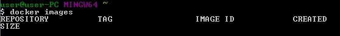
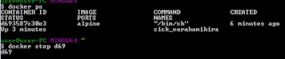
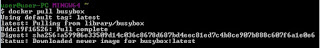
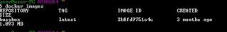
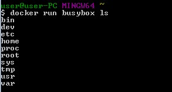

# Praktikum-Teknologi-Cloud-Computing
Praktik kali ini menggunakan docker
Docker adalah sebuah proyek yang bersifat open source dibawah lisensi Apache yang bisa dipergunakan secara gratis oleh developer dan berfungsi sebagai wadah atau container untuk memasukkan sebuah aplikasi secara lengkap beserta semua hal lainnya yang dibutuhkan sehingga dapat berjalan dimana saja. Dalam hal ini, developer atau sysadmin dapat menjalankan aplikasi di mana pun misalnya di laptop, data center, virtual machine dan cloud.
Berikut langkah-langkah untuk menggunakan docker :
 
 untuk menampilkan images di dalamnya makan dengan menggunakan perintah >> docker images
dan tampilan seperti pada gambar di atas. 
  
 untuk perintah docker ps yaitu digunakan untuk melihat isi dari docker tersebut.
dengan menggunakan perintah >> docker ps maka akan menampilkan seperti gambar di atas. 
  
  untuk perintah docker pull busybox digunakan unruk mendownload untuk semua file yang ada di dalam docker tersebut. tunggu sampai selesai docker tersebut agar bisa digunakan dan dapat menampilkan file-file yang sudah di download. 
  
 pada perintah docker image berikut yaitu digunakan untuk melihat isi dari image di dalam docker tersebut, karna sudah selesai download maka image akan ada isinya dengan image ID 2b8fd9751o4c. 
  
 docker run -i -t alpine /bin/sh digunakan untuk akan masuk ke dalam sel busybox yaitu folder yang menampung file-file docker yang sudah di simpan di dalamnya. 
 
 perintah docker run busybox ls >> yaitu digunakan untuk melihat menu atau file-file yang berada di dalam docker itu sendiri dan akan menampilkan dari isi docker.
