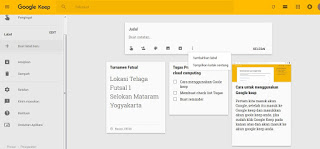
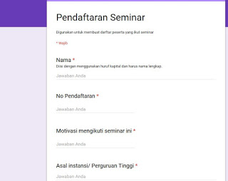
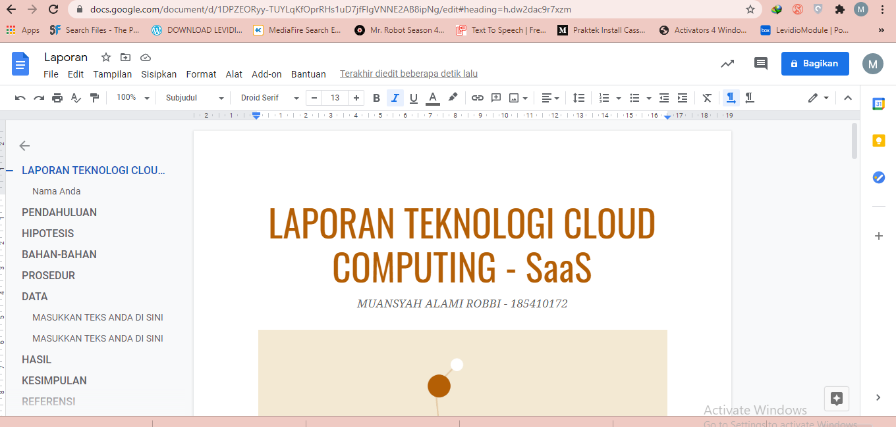

# Software as a Service (SaaS) 
## 1. Google Keep

Google keep digunakan untuk menuliskan catatan-catatan, pengingat sebuah kegiatan yang kadang kita sering terlupakan. Google keep juga bisa menggunakan penambahan label centang maupun label pemilihan pada setiap kolomnya. Google keep juga memungkinkan pengguna untuk membagikan catatan mereka kepaa teman-teman meraka secara umum.
Seperti berikut tampilan dari Google keep :
 
## 2. Google Formulir

Google formulir digunakan untuk mengisi formulir suatu pendaftaran mahasiswa, instansi, seminar ataupun kegiatan lainya yang menggunakan data pendaftaran terlebih dahulu. Dalam pengisian form pendaftaran maka akan ada ketentuan yaitu wajib diisi ataupun tidak wajib diisi dengan menambahkan atau mengaktifkan font wajib diisi terlebih dahulu.
Pilihan opsi untuk menjawab juga bisa disesuaikan dengan jawaban yang nantinya akan ditampung dalam form tersebut, maka untuk memilih opsi jawaban pilihlah seluai dengan jawaban yang akan dijawab oleh pendaftar.
Berikut gambar tentang Google Formulir :
   
## 3. Google Dokumen 

Google dokumen digunakan untuk membuat dokumen fungsinya juga seperti office word. Namun di dalam google dokumen ini tugas pembuatan dokumen bisa di bagi atau bisa di kerjakan bersama dengan teman atau patner kerja. Dengan menghubungkan dengan gmail yang digunakan untuk login.
contoh google dokumen:
  
